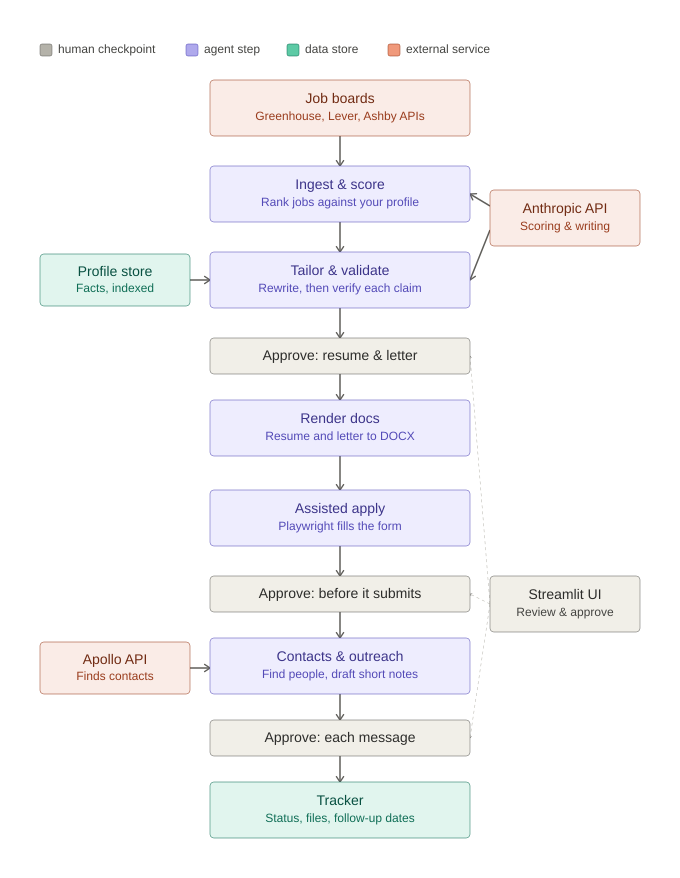

# Job Application Agent

A LangGraph agent that finds jobs matching my resume, tailors a resume and cover letter per job, assists with the application, and drafts outreach to hiring managers, recruiters and peers. Every irreversible step (submitting an application, sending a message) waits for my explicit approval -- enforced with LangGraph `interrupt()`, not just a UI convention.

See [PLAN.md](PLAN.md) for the full build plan and [CLAUDE.md](CLAUDE.md) for the working rules. Architecture:



## Status

All five phases from PLAN.md are built and covered by tests (`uv run pytest tests` and `uv run pytest evals`). What's real vs. still a placeholder:

- **Working end to end, proven with live runs (not just mocks):** job discovery (Greenhouse/Lever/Ashby), scoring, tailoring + fact-checking, DOCX rendering, assisted browser-based apply (stops before submit), contact lookup via Apollo (gracefully degrades if the key/plan doesn't support it), outreach drafting, tracking, follow-up scheduling, a daily-run command, and basic metrics.
- **Needs your own data before it's useful, not more code:** `profile/profile.json` is currently dummy data (see `profile/profile.schema.json` for the shape); `profile/companies.yaml` has no real target companies yet.
- **Genuinely thin:** the Streamlit UI works but is minimal; `evals/golden_jobs/` has no real labeled data yet, so the scoring-agreement and tailoring-truthfulness evals are skipped in CI until you add some (see `evals/README.md`).

## Quickstart

```bash
uv sync
cp .env.example .env  # fill in ANTHROPIC_API_KEY at minimum
uv run jobagent init-db
uv run jobagent ingest       # needs real companies.yaml entries to find anything
uv run jobagent shortlist
uv run streamlit run src/jobagent/ui/app.py
```

## Day to day

```bash
uv run jobagent daily         # ingest + score + save/email the shortlist
uv run jobagent start <id>    # kick off the pipeline for one scored job
uv run jobagent resume <id> --approve|--reject   # act on a paused approval gate
uv run jobagent status <id>   # see what a thread is paused on
uv run jobagent followups     # applications with a follow-up due
uv run jobagent mark-sent <outreach_id>
uv run jobagent mark-replied <outreach_id>
uv run jobagent metrics       # applications/week, outreach response rate
```

## Running it daily

`jobagent daily` doesn't register itself anywhere -- run it manually, or register it with Windows Task Scheduler yourself:

```powershell
schtasks /create /tn "JobAgentDaily" /sc daily /st 08:00 /tr "'C:\path\to\job-agent\.venv\Scripts\jobagent.exe' daily"
```

(Replace the path with your actual `.venv` location.) Remove it later with `schtasks /delete /tn "JobAgentDaily"`.
